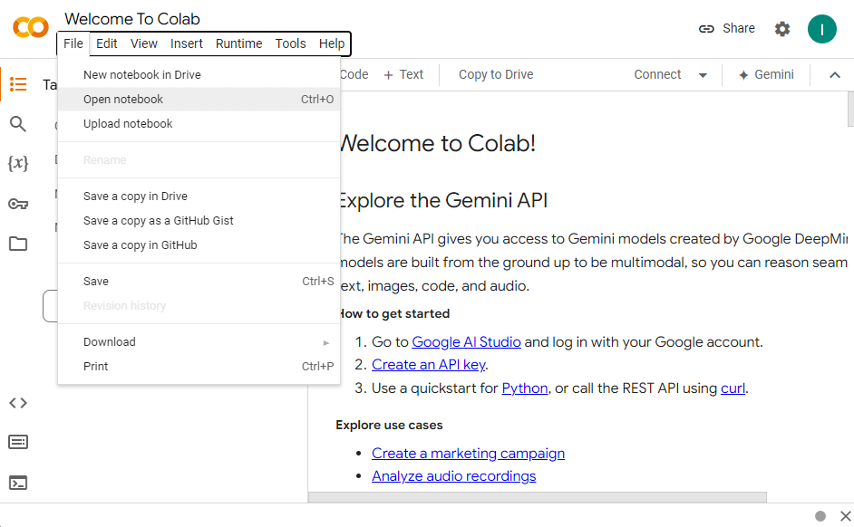
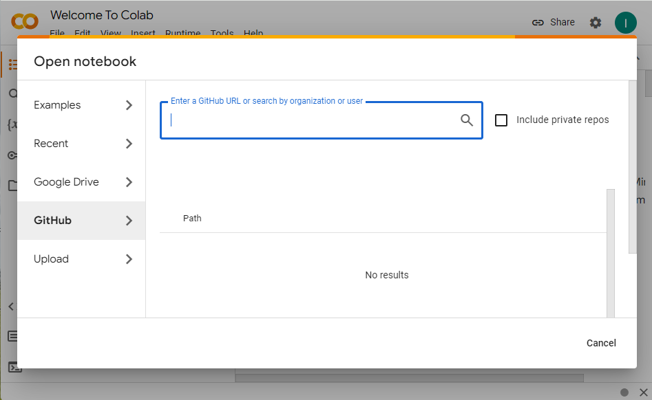

## PFAS Radicals: A Quantum Chemistry Perspective  
---
  
This repository contains the instructor and student materials for the lab activity described here (doi).  
  

This guided-inquiry lab activity is designed for upper-level undergraduate physical chemistry students. Students are tasked with explaining the differences between the optimized geometry of the CF3 radical and the CH3 radical which is relevant to remediation of per-and polyfluorinated alkyl substances (PFAS). This activity is designed to equip students with skills needed for a longer computational chemistry CURE using ORCA and python to perform and analyze calculations.  
  
**Learning Outcomes**
* Students gain exposure to the ORCA quantum mechanics modeling software.  
  * Students can perform geometry optimizations and frequency calculations.  
  * Students can perform constrained geometry optimizations.  
* Students can critically evaluate data resulting from quantum chemical calculations, including interpreting molecular orbital shapes, energies, bond lengths, bond angles and force constants.  
* Students gain exposure to basic python tools commonly used by computational chemists
  * Students can modify python functions to automate input file preparation and output file parsing.  
  * Students can modify python scripts to plot data  
  
The lab activity consists of 3 modules. Each module is stand-alone and can be completed in any order, however we recommend starting in sequence.  
We assume that the instructor has access to an ORCA distribution on an institutional HPC, or can facilitate downloading ORCA (available for free [here](https://orcaforum.kofo.mpg.de/app.php/portal)).  
  
Each module contains a student-facing python notebook with incomplete code and an instructor version with the completed code and useful annotations. Intermediate data is also included so that each module can be run independently of each other, in addition to supplemental data that students will not be asked to generate. In principle, this lab activity could be performed without the use of the ORCA program and instead running only on the data archived here.  
  
The python notebooks associated with each module can be downloaded and run locally, but we have opted for integration with GoogleColab. This is an online service that does not require students to install or setup python on their local machines, limiting the integration requirements. We assume that the instructor has limited familiarity with python, but most tasks are simple enough that a quick google or query to an LLM should be able to resolve issues should they arise. We also assume that students have had a basic programming course, but have not been exposed to using python for research tasks.
  
The modules are as follows:  
>  
>**Module 1**  
>  
>1. Model the equilibrium geometry and IR frequencies of the CH3 radical and compare to the CF3 radical  
>2. Develop a Python function to parse data from ORCA output files  
>
>**Module 2**  
>  
>3. Scan the X-C-X bond angle from 120 degrees (trigonal planar) to 109.5 degrees (tetrahedral) and compare results between the CH3 radical and the CF3 radical  
>4. Develop a Python function to write and edit ORCA input files  
>
>**Module 3**  
>  
>5. Use Python to analyze results from your ORCA calculations  
>  
  
### Downloading Content
---
To get started, navigate to GoogleColab: https://colab.research.google.com/  

Open a new notebook:  
  
  
Paste the URL of this github repository:  
  
  
Open the `student_materials.ipynb` script or the `instructor_materials.ipynb` script to get started.
  

---
Isaac Spackman, Jacob States and  Shubham Vyas  
**Colorado School of Mines**   
*Department of Chemistry and Geochemistry*  
1500 Illinois Ave. Golden, CO 80401 